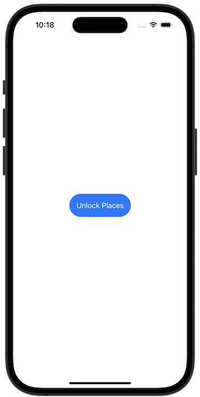
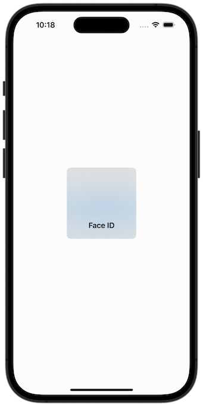
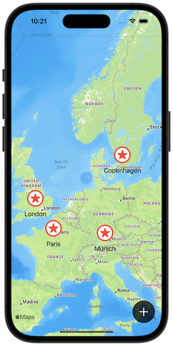
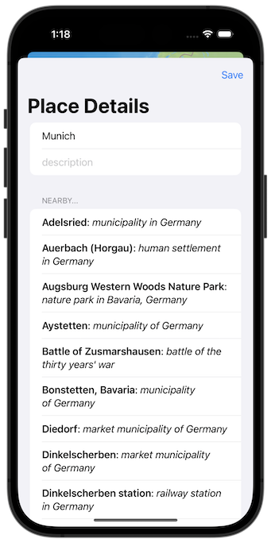
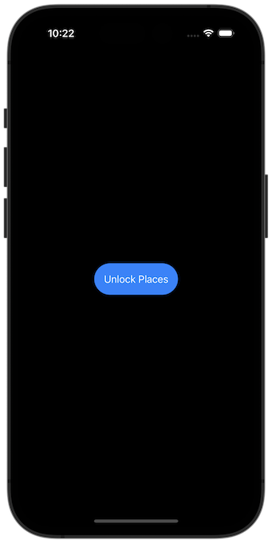
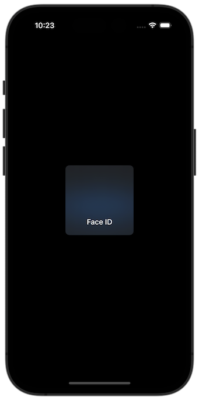
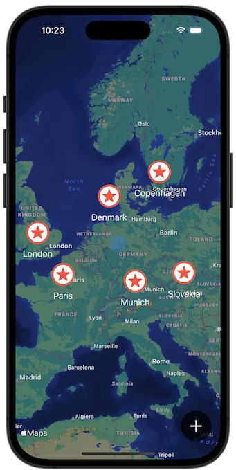
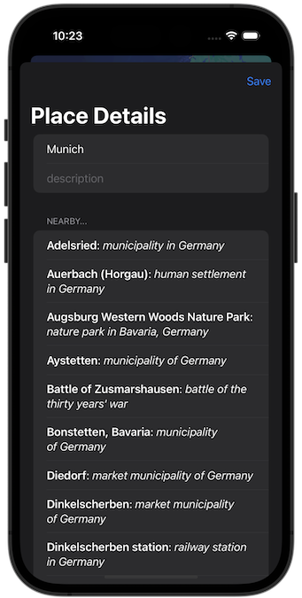

# Project 14 - Bucket List

https://www.hackingwithswift.com/100/swiftui/68

Includes solutions to the [challenges](https://www.hackingwithswift.com/books/ios-swiftui/bucket-list-wrap-up).

## Topics

MapKit, Biometric authentication, Secure data writing, Comparable custom types, Documents directory

## Challenges

From [Hacking with Swift](https://www.hackingwithswift.com/books/ios-swiftui/bucket-list-wrap-up):

> 1.  Our + button is rather hard to tap. Try moving all its modifiers to the image inside the button – what difference does it make, and can you think why?
> 2.  Our app silently fails when errors occur during biometric authentication, so add ode to show those errors in an alert.
> 3.  Create another view model, this time for EditView. What you put in the view model is down to you, but I would recommend leaving dismiss and onSave in the view itself – the former uses the environment, which can only be read by the view, and the latter doesn’t really add anything when moved into the model.

## Screenshots

### Light Mode

### Dark Mode

